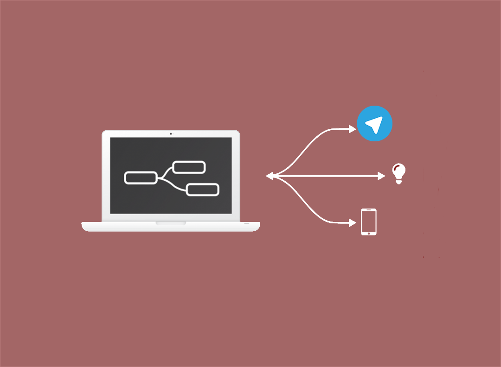
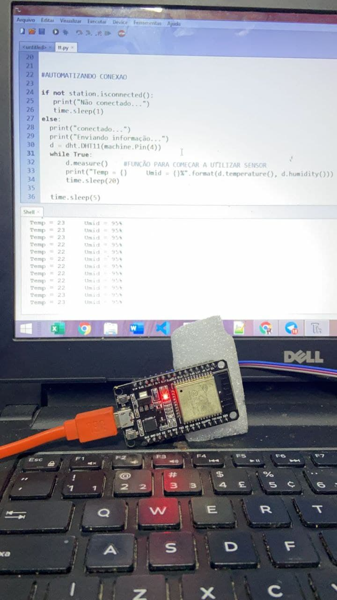
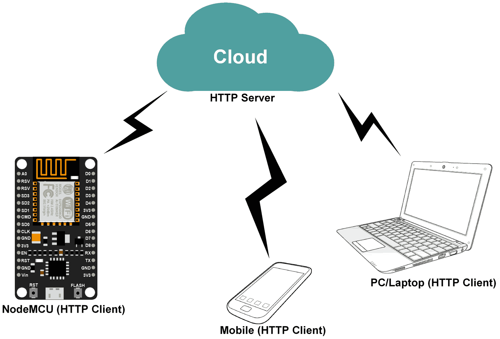

# Integração entre Iot telegram.

* De inicio , para parte do Esp32 com sensor , precisamos ter Thonny IDE Firmware para Esp32 e o sensor DHT11.
* Parte de monitoramento do IOT temos o Broker do Cayenne para fazer a conexão com o dispositivo.

* Parte de integração não está feita pois não consegui instalar os modulos para conexão UMQTT. - EM PROGRESSO
* Para rodar é só rodar a File esp32.py
* A parte da simulação de envio da temperatura , e feito por uma função que retorna numero randomico, apenas para fins de simulação.
* Parte do telegram foi feita com o pacote python-telegram-bot, apenas função de envio.

### Autor
---

 
  
 <b>  Vinicius Farineli Freire</b></a>

Feito  por Vinicius Farineli Freire 👋🏽 Entre em contato!

 

### Pré-requisitos

Antes de começar, eu utilizei o interpreter Micropython no Thonny e Python 3.8, Alem disso Pycharm e Thonny:

Além disto é bom ter um editor para trabalhar com o código como [Pycharm](https://www.jetbrains.com/pycharm/download/)

## Links consultados

https://medium.com/@andymule/micropython-in-pycharms-basic-setup-9169b497ec8a

